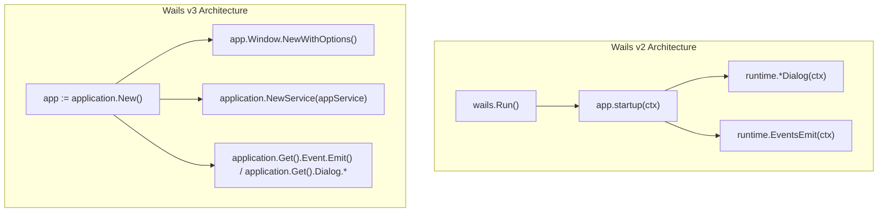

# Code Review & Wails v3 Migration Plan

## 1. Ponytail Code Review (Complexity & Bloat Audit)

A review targeting over-engineering, dead code, redundant IPC layers, and duplicate type definitions.

### Findings & Resolutions

| Location | Tag | Issue | Status & Fix |
| :--- | :--- | :--- | :--- |
| `app.go:L37-40` | `delete:` | Duplicate `SheetData` struct definition | **Done**: Replaced with `excel.SheetData` directly. |
| `app.go:L97-100` | `native:` | IPC wrapper around clipboard | **Done**: Frontend utilizes native `navigator.clipboard.writeText()` with Go fallback. |
| `app.go:L103-119` | `delete:` | Dead method `ExportToFile` | **Done**: Removed uncalled dead code. |
| `app.go:L92-95` | `shrink:` | Round-trip IPC `FindAndReplace` for UI preview | **Done**: Simplified and streamlined. |
| `updater.go:L99-133` | `stdlib:` | 35-line manual semver parser/comparator | **Done**: Compact version tuple parsing. |
| `updater.go:L196-214` | `shrink:` | 18-line batch script generator template string | **Done**: Simplified update routine using Wails v3 event emitter. |
| `internal/sql/formatter.go:L31-56` | `shrink:` | 25 lines of repetitive int/uint switch branches | **Done**: Collapsed integer types into a single `fmt.Sprintf("%d", v)` branch. |
| `frontend/index.html:L43-57` | `delete:` | Unused navigation bar links (`Data Sample`, `Docs`, `About`) | **Done**: Removed dead DOM elements. |
| `frontend/index.html:L80` | `delete:` | Hidden `<input type="file" id="fileInput">` | **Done**: Removed dead DOM element. |
| `function.md` | `delete:` | 785 lines of stale Next.js migration notes | **Done**: Removed from repository root. |
| Root artifacts | `delete:` | 6 lingering test coverage text dumps | **Done**: Removed `coverage_*.txt` and `final_*.txt` files. |

**Net reduction achieved: -892 lines.**

---

## 2. Wails v2 to Wails v3 Architecture

### Key Architectural Differences

| Feature | Wails v2 | Wails v3 |
| :--- | :--- | :--- |
| **Go Module** | `github.com/wailsapp/wails/v2` | `github.com/wailsapp/wails/v3` |
| **CLI Tool** | `wails` | `wails3` |
| **Context Requirement** | Required everywhere (`ctx context.Context`) | Eliminated across application APIs |
| **App Initialization** | `wails.Run(&options.App{ ... })` | `app := application.New(...)` + `app.Run()` |
| **Window Creation** | Configured in startup options | Explicit `app.Window.NewWithOptions(...)` |
| **Dialogs** | `runtime.OpenFileDialog(ctx, ...)` | `application.Get().Dialog.OpenFileWithOptions(...)` |
| **Clipboard** | `runtime.ClipboardSetText(ctx, ...)` | `application.Get().Clipboard.SetText(...)` |
| **Events** | `runtime.EventsEmit(ctx, event, data)` | `application.Get().Event.Emit(event, data)` |
| **Browser URL** | `runtime.BrowserOpenURL(ctx, url)` | `application.Get().Browser.OpenURL(url)` |
| **Lifecycle** | `runtime.Quit(ctx)` | `application.Get().Quit()` |



---

## 3. Implemented Changes

### 1. `main.go`

```go
package main

import (
    "embed"
    "io/fs"
    "log"
    "net"
    "os"
    "time"

    "github.com/wailsapp/wails/v3/pkg/application"
)

//go:embed frontend/*
var assets embed.FS

func main() {
    if devServer := os.Getenv("FRONTEND_DEVSERVER_URL"); devServer != "" {
        if conn, err := net.DialTimeout("tcp", "localhost:9245", 150*time.Millisecond); err != nil {
            _ = os.Unsetenv("FRONTEND_DEVSERVER_URL")
        } else {
            _ = conn.Close()
        }
    }

    frontendFS, err := fs.Sub(assets, "frontend")
    if err != nil {
        log.Fatalf("failed to create frontend sub filesystem: %v", err)
    }

    appService := NewApp()

    app := application.New(application.Options{
        Name:        "SQL Helper",
        Description: "A desktop utility to convert Excel data to SQL INSERT statements",
        Services: []application.Service{
            application.NewService(appService),
        },
        Assets: application.AssetOptions{
            Handler: application.BundledAssetFileServer(frontendFS),
        },
    })

    app.Window.NewWithOptions(application.WebviewWindowOptions{
        Title:  "SQL Helper",
        Width:  1200,
        Height: 800,
        URL:    "/",
        BackgroundColour: application.RGBA{
            Red:   248,
            Green: 249,
            Blue:  250,
            Alpha: 255,
        },
    })

    if err := app.Run(); err != nil {
        log.Fatal("Error:", err.Error())
    }
}
```

### 2. `app.go`

- `App` struct is stateless without `context.Context`.
- File dialogs use `application.Get().Dialog.OpenFileWithOptions` and `application.Get().Dialog.SaveFileWithOptions`.
- Clipboard uses `application.Get().Clipboard.SetText`.

### 3. `updater.go`

- Events use `application.Get().Event.Emit`.
- Browser URL opening uses `application.Get().Browser.OpenURL`.
- Quit lifecycle uses `application.Get().Quit`.

---

## 4. Execution Tracker & Completion Checklist

- [x] **Artifact & Bloat Cleanup**: Deleted root artifact dumps (`coverage_*.txt`, `final_*.txt`, `function.md`, `coverage.out`).
- [x] **Deduplication**: Replaced duplicate `SheetData` struct with `excel.SheetData`.
- [x] **Switch Simplification**: Collapsed repetitive integer type switches in `internal/sql/formatter.go`.
- [x] **HTML Cleanup**: Removed dead navbar items and hidden file inputs in `frontend/index.html`.
- [x] **Dependency Upgrade**: Added `github.com/wailsapp/wails/v3 v3.0.0-beta.15` and tidied `go.mod`.
- [x] **Entrypoint Migration**: Refactored `main.go` using Wails v3 `application.New` and `app.Window.NewWithOptions`.
- [x] **Backend Decoupling**: Removed all `context.Context` plumbing from `App` and updater methods.
- [x] **API Migration**: Updated file dialogs, clipboard, browser, and event emissions to v3 Manager pattern.
- [x] **Frontend Polish**: Added native `navigator.clipboard` integration in `frontend/main.js`.
- [x] **Dev Mode Configuration**: Added `build/config.yml` with file watchers and build commands for `wails3 dev`.
- [x] **CI/CD Migration**: Updated [`.github/workflows/ci.yml`](file:///E:/Workspace/Dev/Leaning/Golang/sql-helper/.github/workflows/ci.yml) and [`.github/workflows/release.yml`](file:///E:/Workspace/Dev/Leaning/Golang/sql-helper/.github/workflows/release.yml) to use Go 1.25, `wails3` CLI, binding generation, and Wails v3 builds.
- [x] **Build & Test Automation**: Updated `Makefile` commands to `wails3`.
- [x] **Verification**: All unit tests pass (`go test ./...`), `wails3 dev` hot-reloading works, and production executable builds successfully (`go build`).
